# 一.递归算法
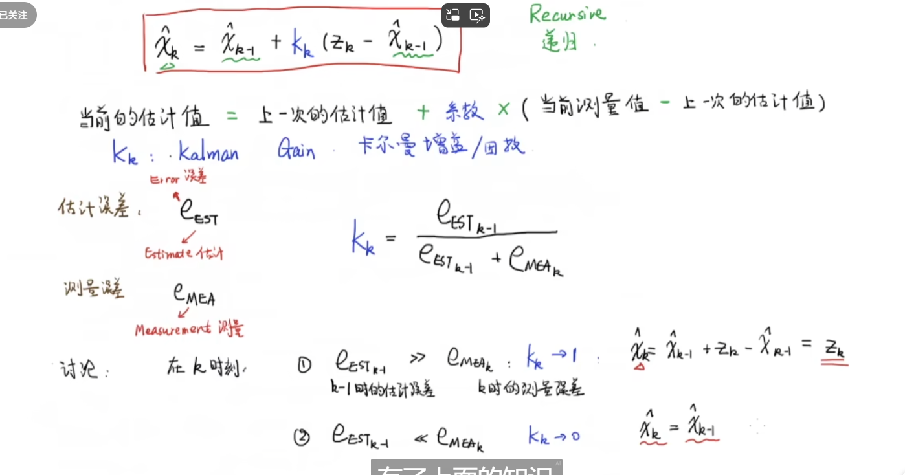
# 二.数学基础
## 数据融合
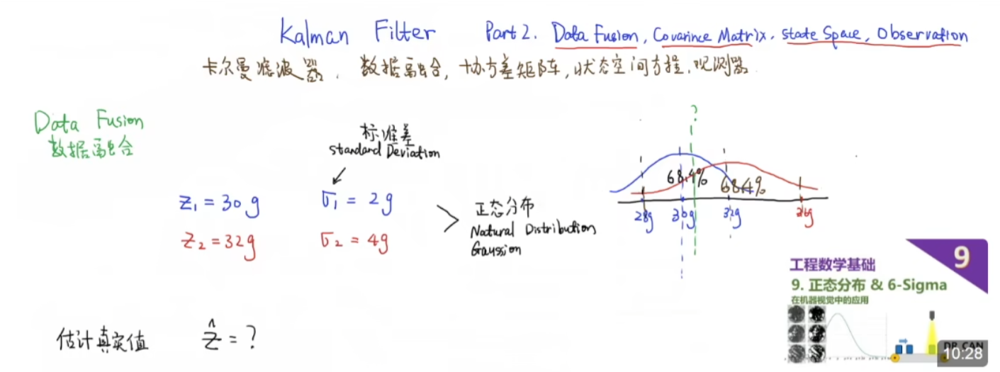
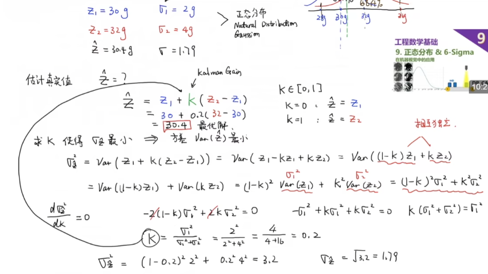
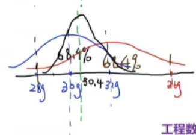

## 协方差矩阵
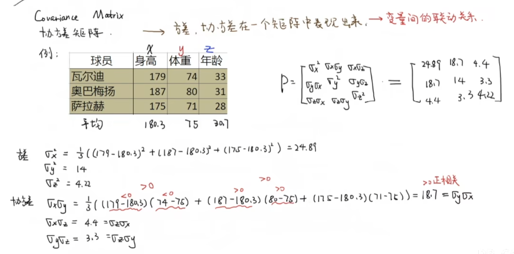
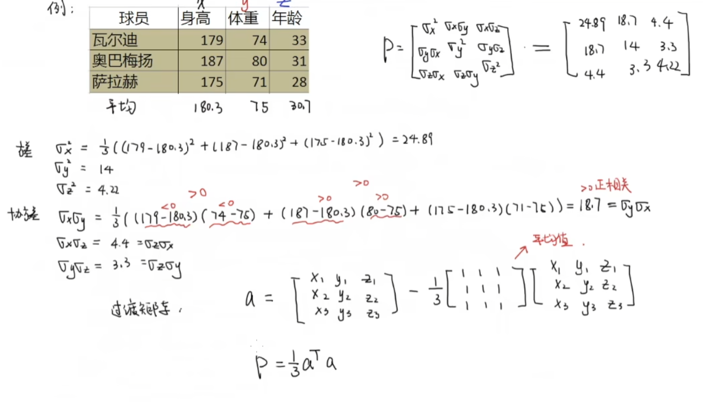
- **对于协方差矩阵，主对角线上的数据代表那个变量的方差，对于协方差的数据，大于零表示对应的两个变量正相关，且越大相关性越强（相关系数的分子）**
  
## 状态空间方程
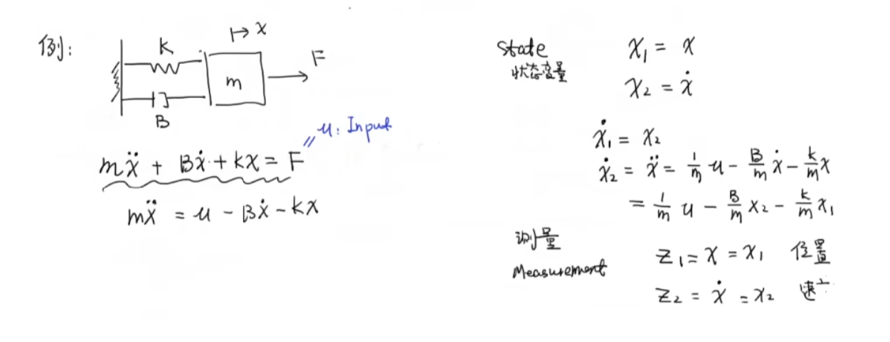
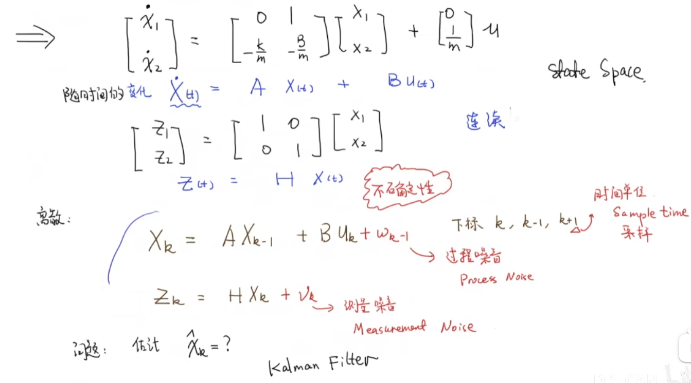
- **其中Xk可以看成计算（估计）结果，Zk可以看成测量结果，重点是二者的Data Fusion**

# 三.Kalman **Gain数学推导**
**补充：先验是通过已有的知识建立数学模型，进而推出本时刻的状态，该状态就叫先验估计，由于模型的不精确，再使用测量得到的状态值（也不精确）做修正，进而只能得到状态的估计值（也即后验）**
- Zk于Xk之间是有着H的矩阵变化的，就像是电流x电阻=电压，所以此处的H可以理解为状态变换矩阵
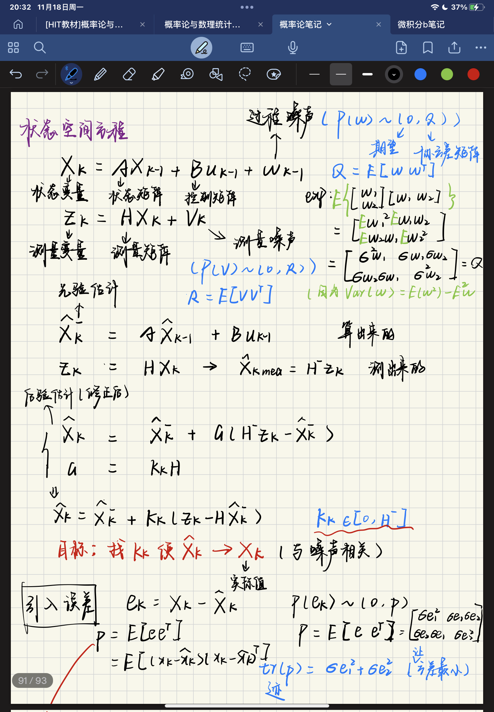
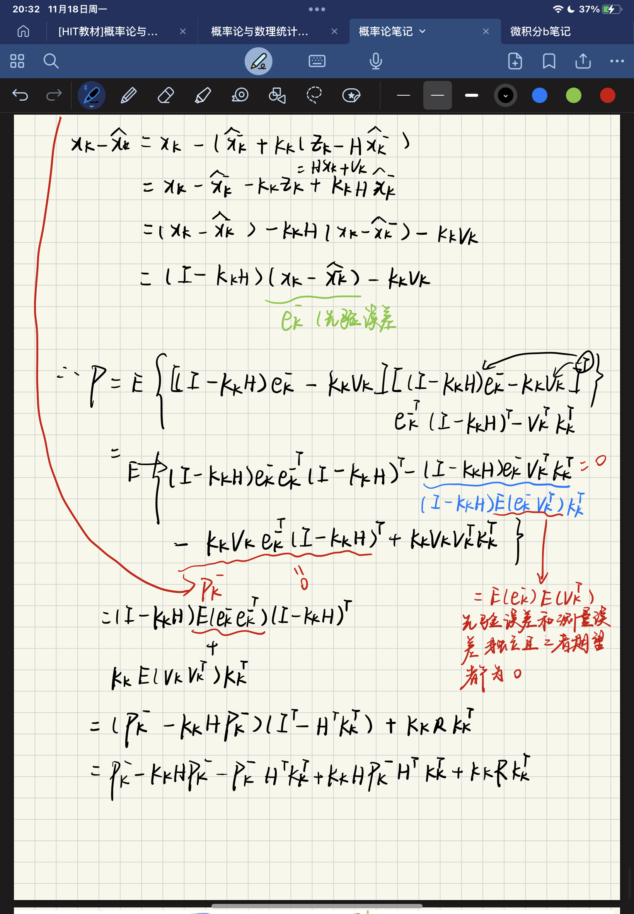
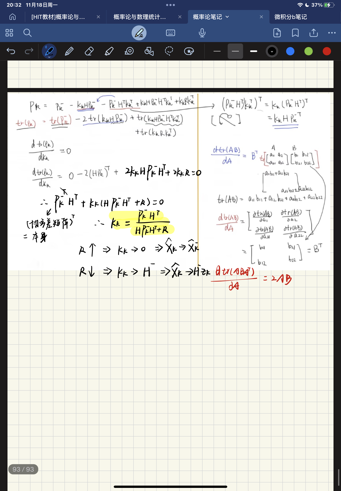

# 四 误差协方差矩阵数学推导_卡尔曼滤波器的五个公式
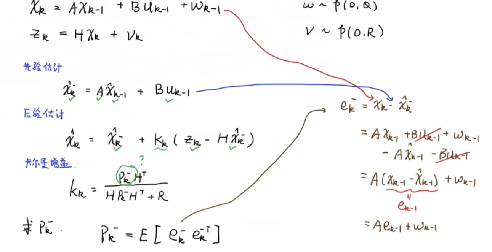
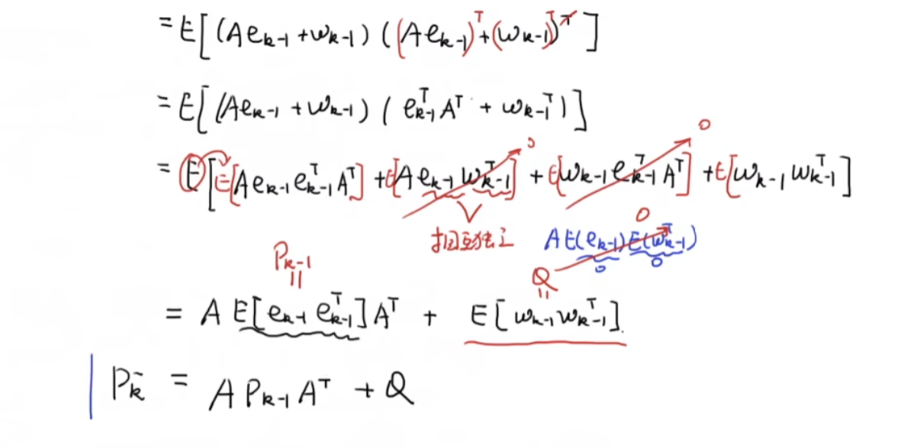
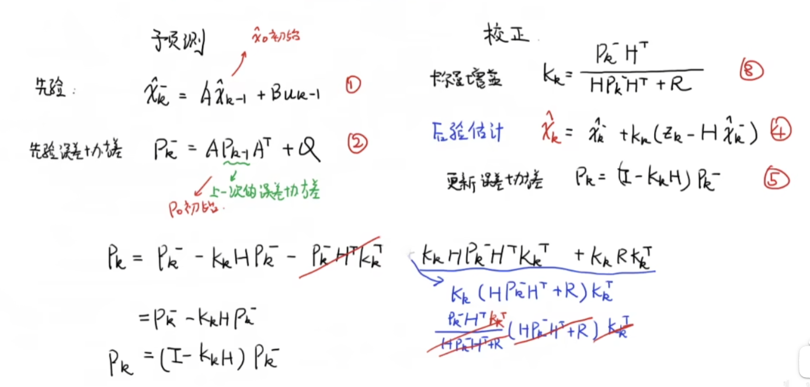
**预测完成之后更新**

# 调节超参数（Q，R）
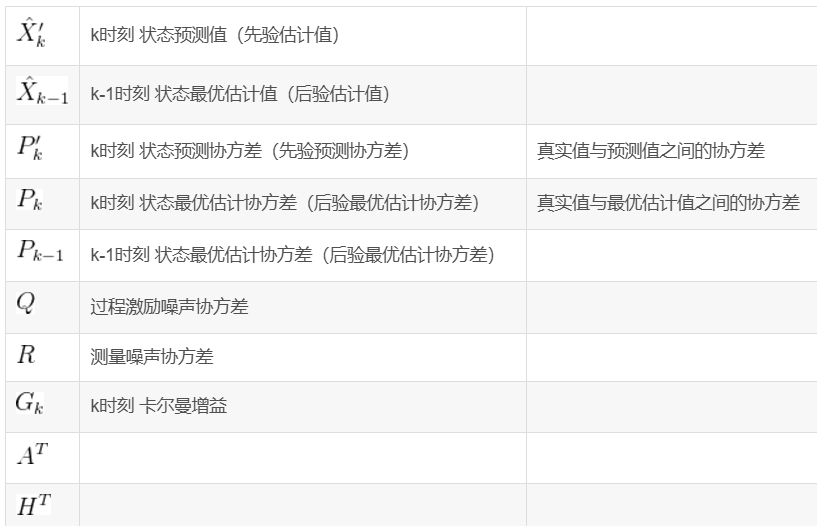
- 噪声可以理解为你对这个信号的不信任程度，来源于自己的假设和现实的结合，在假设的时候并不是不可以改变的
- 如果运动过程中环境方面的不确定干扰小（运动模型精度高），则过程噪声协方差矩阵Q可以给小，若测量设备精度高，则测量噪声协方差矩阵R可以给小
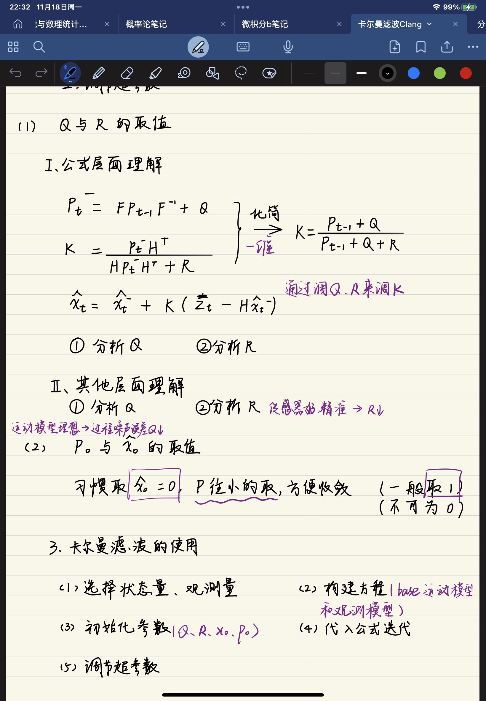