<!-- 本文档建议使用md文件的预览模式阅读，自动生成的pdf排版不佳 -->
<!-- 建议使用vscode 的 markdown all in one 插件预览 -->

<style>
  body {
    background-color: #1f1f1f;
    background-image: url('img/封面.png'); /* 背景图片路径 */
    background-size: 100% 2.5%; /* 背景图片覆盖比例 */
    /*background-position: center;  背景图片居中显示 */
    background-repeat: no-repeat; /* 不重复背景图片 */
  }
</style>

**<center><font size = 7 face = "Calibri" color = #ffffff>WTR</font><font size = 7 face = "楷体" color = #ffffff>电控经验手册</font></center>**

<br/><br/><br/><br/><br/><br/><br/><br/><br/><br/><br/><br/><br/><br/><br/><br/><br/><br/><br/><br/><br/><br/><br/><br/><br/><br/><br/><br/><br/><br/><br/><!-- 空行 -->

<div STYLE="page-break-after: always;"></div><!-- 分页 -->

<br/>

**<center><font size = 6 face = "楷体" color = #ffffff>目录</font></center>**

<font size = 4 face = "楷体" color = #f1f1f1><!-- 这行空注释不能删，否则可能会导致pdf导出时字体参数错误 -->

- [前言](#前言)
- [硬件层](#硬件层)
  - [线](#线)
    - [种类](#种类)
    - [端子](#端子)
    - [电滑环](#电滑环)
  - [电源](#电源)
    - [大疆电池](#大疆电池)
    - [航模电池](#航模电池)
    - [分线板](#分线板)
    - [降压器](#降压器)
    - [继电器](#继电器)
  - [电机](#电机)
    - [舵机](#舵机)
    - [大疆电机](#大疆电机)
    - [宇树电机](#宇树电机)
    - [航模电机](#航模电机)
  - [传感器](#传感器)
    - [编码器](#编码器)
    - [光电门](#光电门)
    - [陀螺仪](#陀螺仪)
    - [激光传感器](#激光传感器)
  - [小电脑](#小电脑)
  - [雷达](#雷达)
  - [遥控器](#遥控器)
  - [气缸](#气缸)
    - [稳压阀](#稳压阀)
    - [节流阀](#节流阀)
    - [手阀手动开关](#手阀手动开关)
    - [电磁阀](#电磁阀)
  - [电磁锁](#电磁锁)
- [软件层](#软件层)
  - [软件架构](#软件架构)
    - [代码分层](#代码分层)
    - [状态机](#状态机)
  - [仿真调试](#仿真调试)
    - [仿真器](#仿真器)
    - [matlab仿真](#matlab仿真)
    - [gazebo仿真](#gazebo仿真)
  - [前馈算法](#前馈算法)
    - [阶跃输入平滑化](#阶跃输入平滑化)
    - [开环模型逆前馈](#开环模型逆前馈)
  - [反馈算法](#反馈算法)
    - [PID](#pid)
    - [LQR](#lqr)
    - [MPC](#mpc)
    - [SMC](#smc)
  - [滤波算法](#滤波算法)
    - [滑动窗口滤波](#滑动窗口滤波)
    - [卡尔曼滤波(贝叶斯滤波)](#卡尔曼滤波贝叶斯滤波)
    - [傅里叶滤波](#傅里叶滤波)
  - [定位](#定位)
  - [视觉](#视觉)
- [往年代码](#往年代码)
  - [25](#25)

<div STYLE="page-break-after: always;"></div><!-- 分页 -->

# 前言

本文档是由哈尔滨工业大学(深圳)南工问天战队25届Robocon的主力参赛队员发起的，依据自身参加比赛的经历，为未来首次参加比赛的电控队员准备的电控经验手册。

RC比赛每年的赛题都不同，如果每次都从头开始势必会走很多弯路，但WTR的成立时间并不长，往届电控学长并没有留下足够多的传承，因此，我决定将这两年来收集到的资料，以及遇到的问题和吃过的亏都整理记录下来，作为我们自己的传承。

这篇文档的“介绍”性质大于“教程”性质。很多电控的知识，往往不是事先就会，而是在调试的过程中发现问题，在解决过程中才开始接触学习并应用的。所以，这篇文章的目的仅仅是帮助大家指明方向，针对可能的问题提供可行的解决方案，而非提供详细的教程。当调试时遇到瓶颈，束手无策时，可以再回头来阅读这篇文档。

文档中配上了很多图片，素材来源于网络，尽量选取了贴近实物的图片，但难免有些微小差别，如果有更合适的图可以替换掉。部分我收集到的代码库附在了相应的部分，避免重复造轮。此外，还附带了一些可能用到的上位机软件。

作为“经验手册”，也需要与时俱进。前人的经验可能是过时甚至错误的，我们欢迎所有阅读到这篇文档的同学补充、修改和增加其中的内容。如果你愿意，也可以留下自己名字甚至联系方式，将你的经验分享给未来的学弟。

贡献者：\
thrzer(2025-8-12)；csy(2025-8-15)；kiman(2025-8-18)

<div STYLE="page-break-after: always;"></div><!-- 分页 -->

# 硬件层

这一部分的主要目的介绍各种器件，在设计机器人时对硬件的选择非常重要，电控成员需要了解各个器件的功能和参数，以及其实际使用的上下限在哪。很多时候拼命调参的效果不如直接换个电机，选择是大于努力的。

电控开始调试的第一步就是走线，即将各个器件按照正确方式连接。你会发现调试的大部分时间都在走线，找电池、找线、找电机电调……  所以，清楚地知道自己需要什么很重要。

## 线

### 种类

线分很多种，杜邦线、信号线、电源线和双绞线等，功能各不相同。

杜邦线是测试时最常用的线，有伸出引脚的一端是公头，可以插到别的母头上，所谓公对公，公对母，母对母指的是杜邦线两端的样式。对于任何接头来说，都是类似的定义：能插进别的端子的接口是公，被插进去的接口是母。

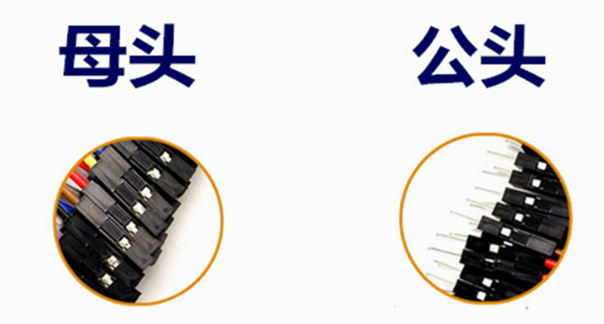

信号线泛指各种用于通信的线，通常比较细，如果是焊接的信号线要格外小心对通信的干扰(例如SPI就是很容易被干扰的一种通信)。为了保证线环境的稳定，可以使用屏蔽网包一层，或者直接焊上双绞屏蔽线。

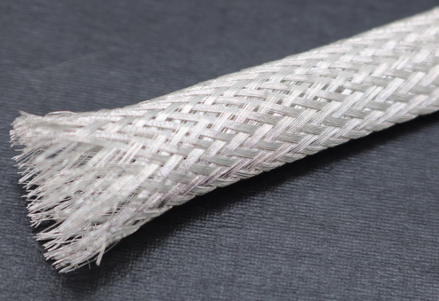

电源线顾名思义是泛指连接电源的线，因为要走大电流通常较粗，电池接上电源线，就可以给设备供电了，两头通常使用XT30或XT60端子。

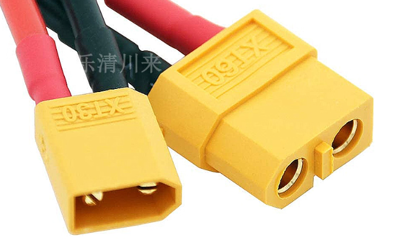

双绞屏蔽线是呈DNA状互相缠绕的两条线，外层还套了屏蔽网，对外界电磁环境有很强的抗干扰能力，通常用在较长或易受干扰的信号线中。也有一些屏蔽线会有很多股，但基本上也是两两一组缠绕。

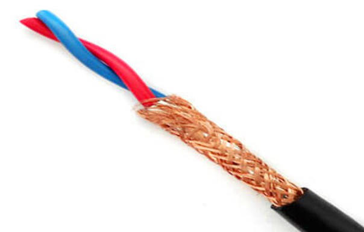

对于一些特殊的需求，也存在很多转接线，例如一端是XT30，另一端是XT60；或者一端是4pinGH1.25，另一端是杜邦头。

### 端子

对于集成为一排的线，两端可以直接使用对应的端子，没有使用端子的称为裸线，单端的裸线通常用于焊接特殊的线序。


根据线的数量，有几条线就叫几pin，7pin线就是指集成了七条线。

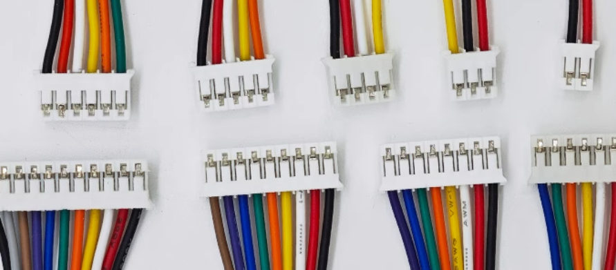

根据线之间的间距，分为SH1.00，GH1.25，PH2.0和XH2.54等。

根据线序，又有正向和反向(或称同向/反向)之分，如果使用了错误线序的端子，后果可能很严重。

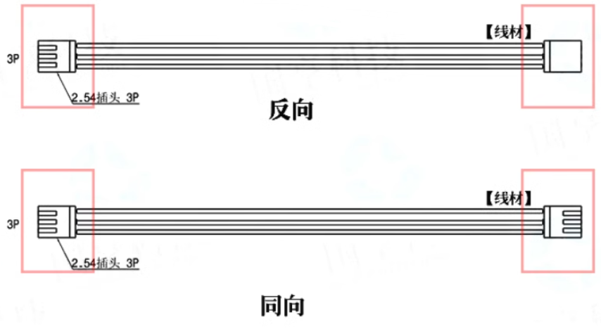

有时候可能需要临时接线，但又不想焊接，就可以使用接线端子直接连接。下图这种端子需要用螺丝刀拧松，伸入裸线后压死。

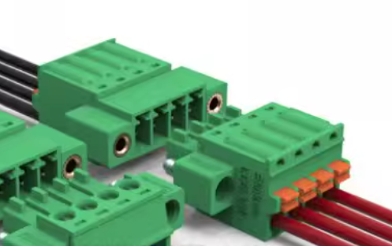

如果你想为裸线增加端子，除了焊接两条单端裸线的方式外，还可以直接使用压线钳把裸线压入空端子。

### 电滑环

有时候机械结构需要转动(例如舵轮和机械臂)，直接接线会导致转动时线发生缠绕，这时候就需要用到电滑环。电滑环自带一段线，两端通常是需要焊接的裸线，在转动时只会转动其中的轴承，避免缠绕。

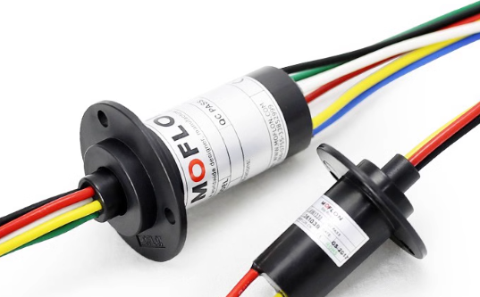

## 电源

### 大疆电池

比较早期的电池，很贵也很好用，但现在已经停产，不太好买了。作为24V供电，供电端是XT60母头。需要对应的电池支架才能供电，由于其支架自带开关，容量也大，是最常用的电池型号。但考虑到其购置问题，建议未来物色新的电池。

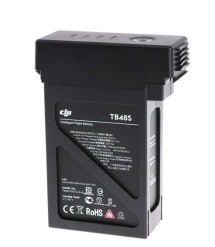

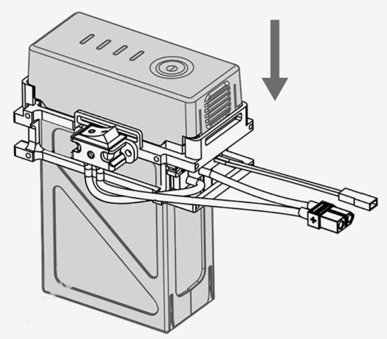

### 航模电池

有不同容量和电压的型号，供电端一般是XT60母头。直接插上就可以供电，但是要注意低压使用容易损坏电池，使用前可以用万用表测一测电压，没电及时充。

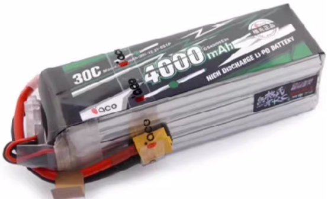

### 分线板

一般至少会有一个XT60公头，用于连接电池，其他用电器件插在别处。能够并联使用的信号线，一般就是2pin或4pin的CAN线，也可以集成在上面，这样只需要留一个接口连到主控板上，从而避免主控板直连大量信号线。

队里有几个黑色的小分线板，这是大疆出版的分线板。其中有7个XT30母头和一个XT60公头，以及一些用于CAN通信的2pin GH1.25母头。

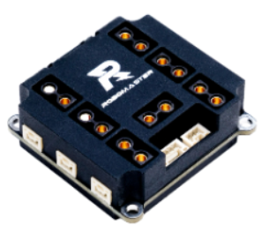

一般来说每年的硬件组同学都会仿制几个这样的分线板，也可以拿来用。如果你在走线的时候发现线比较多，例如有多个电机都需要供电和走CAN线，建议直接使用分线板。若需要的分线板比较特殊，应该明确需求，直接找硬件组同学定制一个，这就是他们该干的活。

### 降压器

降压器就是把高电压降低到低电压，同时可以满足一定的电流输出要求。例如小电脑可能需要19v供电，就需要把24v转19v的降压器的输入端连到分线板上，输出端连小电脑。下图所示的降压器在原理上其实不同于靠电感原理实现的变压器。

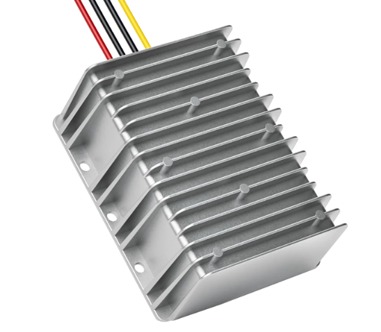

### 继电器

继电器是一种用于控制某些用电器件电压开断的器件，其原理是通过低压控制内部衔铁运动，从而控制高压开断。

其输入端接电源，可以通过跳线帽控制低电平触发或高电平触发，触发时输出端接通。输出端直接连用电器件，可以选择接入常开接口或者常断接口。

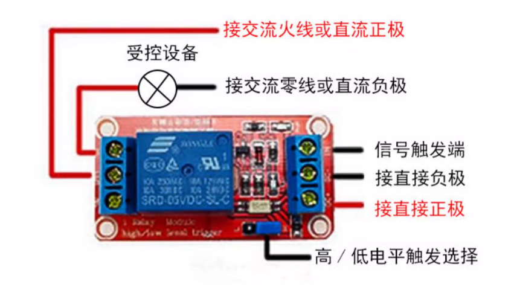

## 电机

一个好电机决定一个电控的一整个赛季。经验之谈是，如果你在调试时发现某个电机不能很好的满足需求，那就应该果断让机械的同学重新设计，更换合适的电机。\
能上赛场的电机一般都不是直流电机(例如经典MG513)，而是需要电调控制。一般来说，通过三相电流驱动的电机都需要电调控制。\
电机名称中的数字指的是电机输出轴的尺寸。例如5010电机代表定子外径为50mm，高度为10mm，通常情况下数字越大电机越大，扭矩也越大。KV值指的是电机在空载状态下，每增加1伏特电压，电机每分钟增加的转速(RPM)。

### 舵机

常用的这款达盛舵机有不同的型号，区别在于舵盘尺寸和力矩。这种电机一般都是180°舵机，因此在组装前需要电控测试运动范围，把舵盘安装在合适的角度。这种舵机都是使用PWM控制，比较简单。

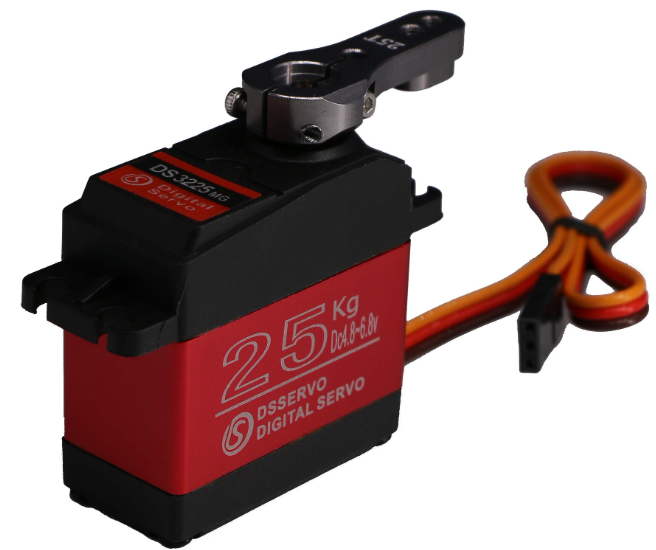

### 大疆电机

大疆电机2006和3508都是最常用的电机，事实上有很多款电机供我们选择，但大家还是对这两个电机情有独钟(其实还是建议多尝试别的电机)，这也证明了其性能足够优秀。这两款电机都自带减速箱和编码器，外表通常标有减速比。其中2006标准减速比是36，3508标准减速比约为19。

2006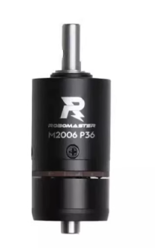
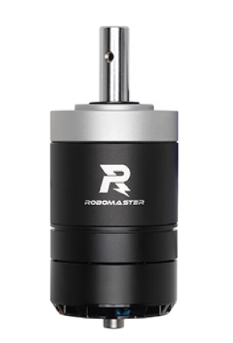3508

这两款电机都需要使用电调控制。2006使用C610电调，3508使用C620电调。两种电调都是24V供电，使用2pinCAN线控制。

C610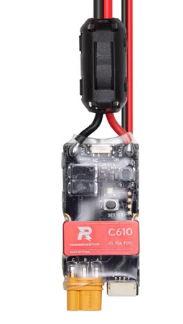
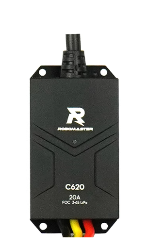C620

[大疆电机代码示例](code/电机/dji_motor/DJI.c)

### 宇树电机

战队常用的型号是宇树go-8010-6，这一款电机的力矩较大，通常用作机械臂的关节电机。\
但是，由于这款电机的信号线容易损坏，电机容易过热，且其代码库比较黑盒(因为是比较早的代码库，读起来复杂)，难以实现精细的控制(相同的参数会跑出不同的效果)，在25年比赛的电控队员中差评如潮。因此，如果对电机精度有要求，需要慎重考虑使用这款电机。

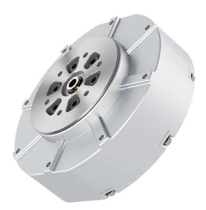

事实上，宇树家的电机并不是都这么难用，理性考察后也可以使用其他好用的型号。

[宇树电机代码示例](code/电机/Unitree_SDK/Unitree_user.c)

### 航模电机

战队常用的型号有5010KV280，这一款电机的力矩中等，但转速极高，配上合适的减速箱也能有大力矩。但这个电机本身不自带编码器和减速箱，需要自己独立购置组装(而这一环节就容易出问题)，因此需要实现对器件进行合适的选型，确保编码器和减速箱都合适后再使用。

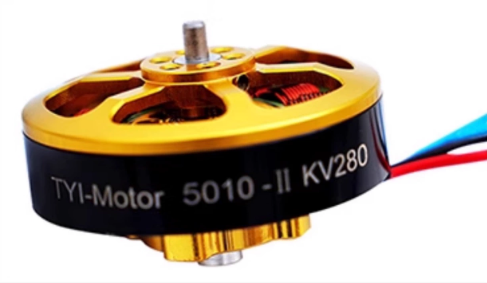

这一款电机通常使用VESC电调(队里使用过MakerX和MakerBase电调)驱动，这款电调需要连usb线至电脑，用上位机软件vesc tools进行配置。具体配置方法可以找学长了解或者阅读代码中(此电机通常应用在舵轮中，因此可以在舵轮的代码中找到)的说明文档。此类电调通常使用4pinCAN发送数据控制。下图是Makerbase VESC MINI V6.7 Pro。

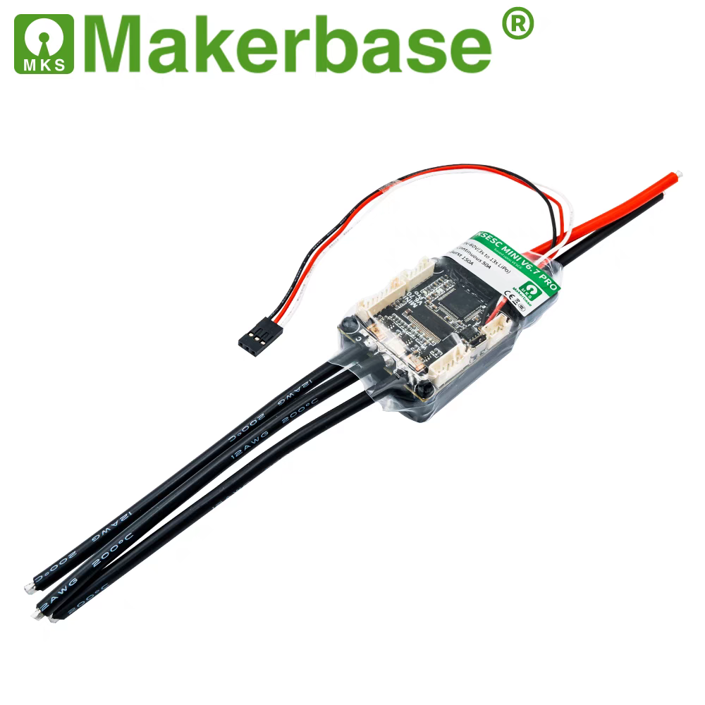

这类电调本质上是将直流电转化为三相电，使用FOC算法对三相电机进行控制，因此各种三相驱动的电机都可以使用这类电调。

[VESC电调代码示例](code/电机/vesc/wtr_vesc.c)

## 传感器

传感器的种类非常之多，一般来说，需要根据商家或者研发公司提供的用户手册操作并使用。

[维特智能软件资料网站](https://wit-motion.yuque.com/wumwnr/aqvq6y)

### 编码器

简单的编码器，如霍尔、GMR编码器通过传递电平信号，以记录脉冲数量的方式来计算旋转的角度。

复杂一些的编码器(如维特智能JY-ME02-CAN角编码器、AS4058A磁编码器)则通过通信协议(如串口或者SPI)来发送角度或角速度信息。

当发送频率较高时，收到的数据精度会下降，产生许多噪声，需要使用合适的滤波器来滤波。

维特JY-ME02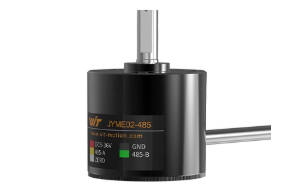\
AS5048A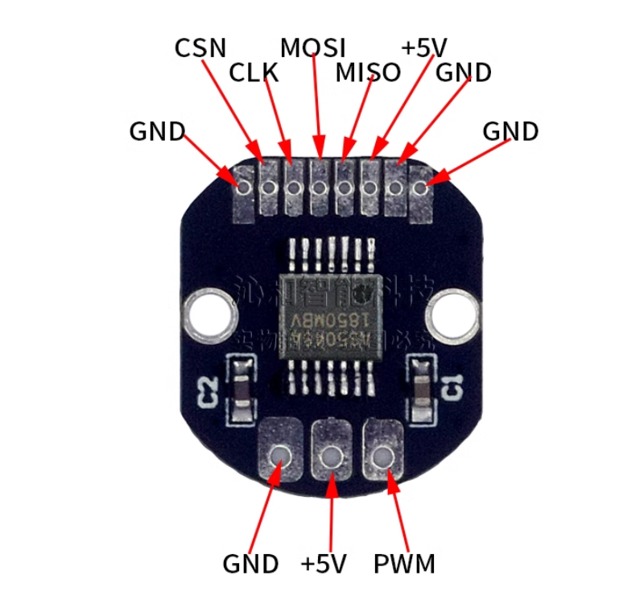

[维特JY-ME02代码示例](code/传感器/JY-ME02/encoder.c)

### 光电门

当有东西伸入遮挡光电门时，会产生高电平信号，使用引脚中断即可捕获。常用来做电机校正复位。

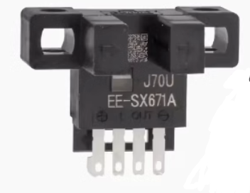

### 陀螺仪

以维特的HWT101CT陀螺仪为例。这款是通过串口发送角度信息的，需要注意的是，它提供的是相对角度，且下电后会保持最后一次角度数据。

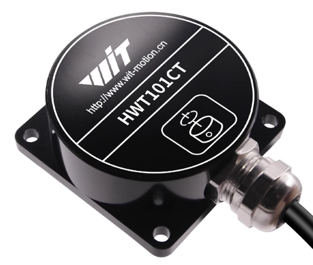

[陀螺仪HWT101CT代码示例](code/传感器/WitGyro/HWT101CT_sdk.c)

### 激光传感器

以DT35激光位移传感器为例。25年比赛使用时是用了一个自制的DT35转接模块，然后又用了一个RS485转串口模块，有点麻烦。配置方法网络上能找到详细的教程，这里就不提供了。它的原理其实就是提供一个模拟电压代表距离，获得当前模拟值时，还需要根据近点远点的模拟值计算出实际距离。

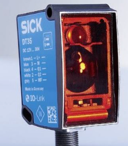

[DT35代码示例](code/传感器/dt35/Laser.c)

## 小电脑

用于上位机，通常还会使用串口把计算好的数据发送到下位机的主控板。不同牌子的小电脑的外观都差不多是长成这样的一个小黑盒。上面有连接电源、网线、USB等的接口。

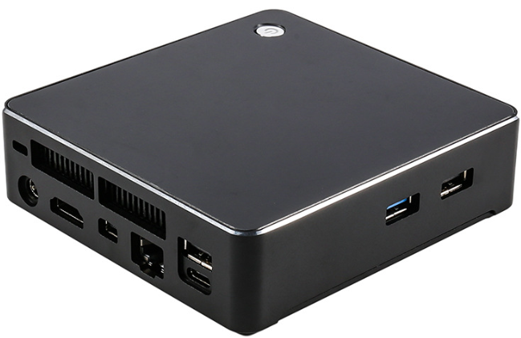

## 雷达

25年比赛使用了mid360激光雷达和宇树L2 3D激光雷达。尽管mid360比L2贵很多，但确实效果好，负责的同学表示“能用mid360就别用L2”。雷达的定位都会有些抖动，最好进行滤波。

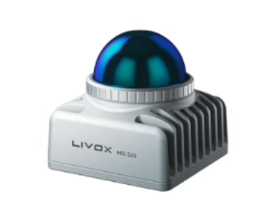

## 遥控器

25年比赛使用的是自制(实则仿制的沈工版)的遥控器。需要使用AS69进行无线数据传输，AS69的数据通过串口发给主控板，解码则是用的mavlink协议(这部分的代码是生成的)。想要完全搞懂非常难，会用即可。\
AS69在遥控器端和主控板端各要一个，可以安装天线改善性能。需要在上位机软件中进行配置，两个模块必须完全一致才能成功配对。\
25年比赛在赛场上遥控器频繁失灵，导致比赛失利。这可能与其发送频率和功率有关。后续比赛如果不能有效解决这一问题，建议更换遥控方式，或者使用成品遥控器。

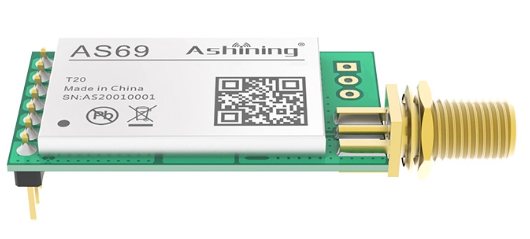

[遥控器代码示例](code/遥控器/Remotectl/rmctl.c)

## 气缸

气缸的型号一般是由机械组同学根据他们的设计需求进行选择。\
控制气缸需要电磁阀跟继电器。只需要简单控制GPIO口的高低电平，来控制继电器的开关状态，进而控制电磁阀的开闭，就能实现气缸的开合运动。\
注意：需要驱动两个相同的同功能的气缸同时运作时，最好将两气缸串联，并且两边的对应的气管都需一样长度。

###  稳压阀

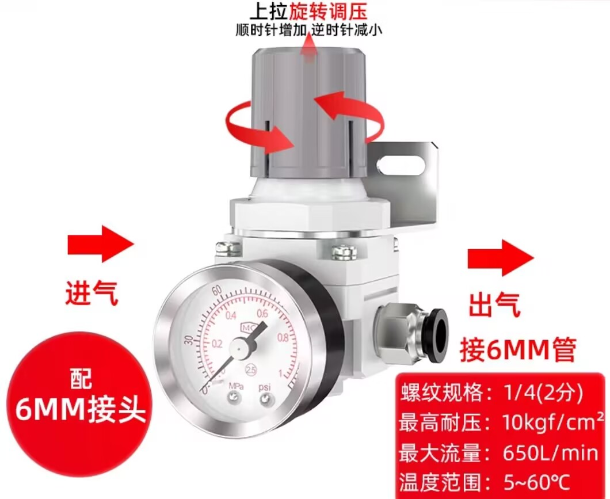

能稳定每次供给的气压，气不够时稳定气压也会随之下降，注意接口方向。
###  节流阀

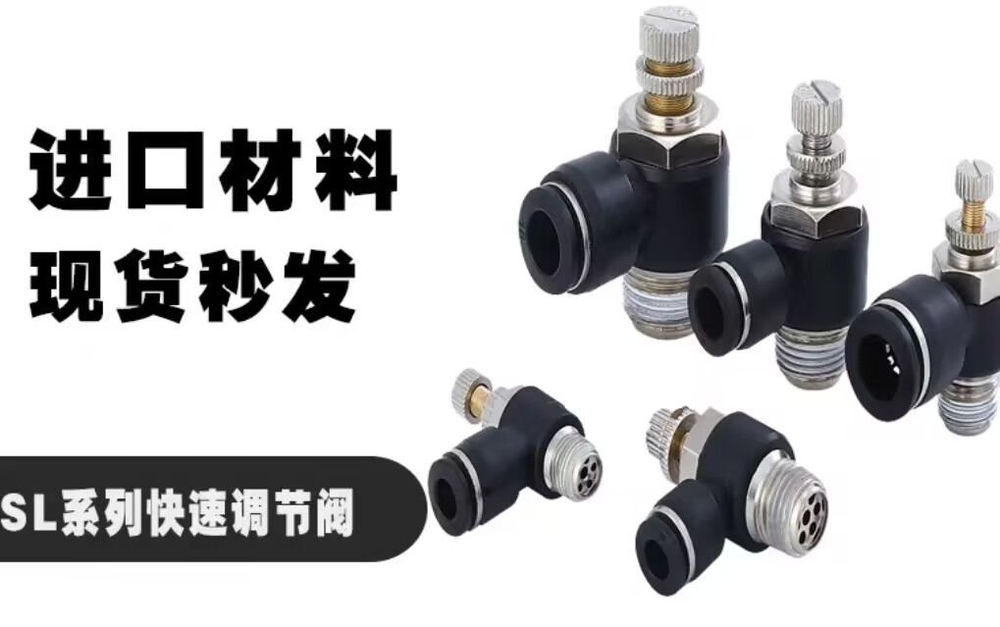

能减缓给气速度，使得气缸运作没有那么迅猛。

### 手阀手动开关

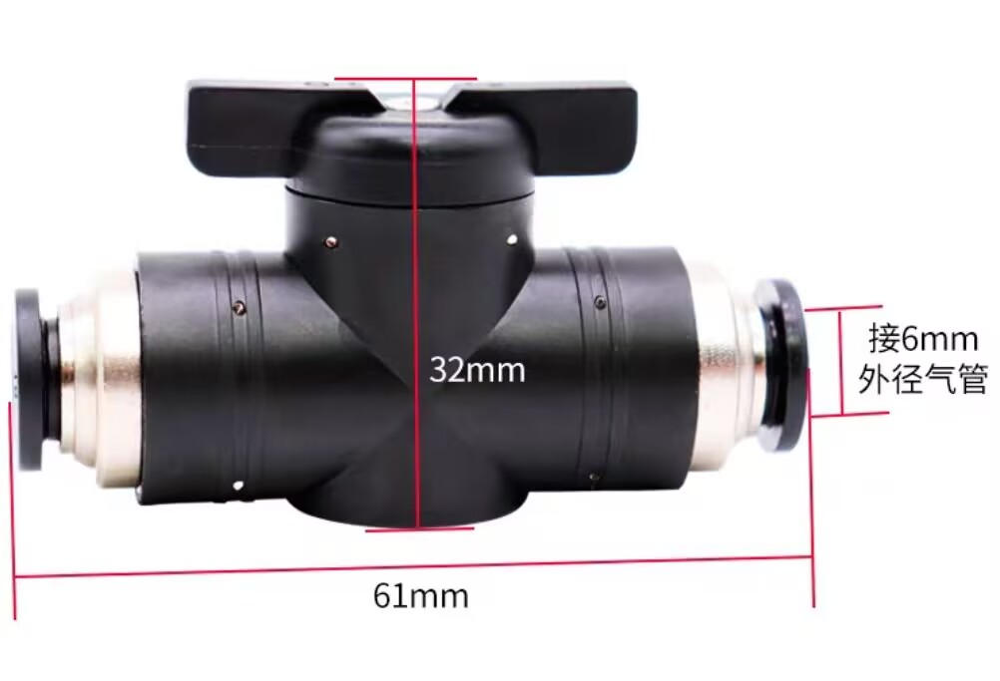

接在气瓶尾端，气瓶推荐大号雪碧瓶，外缠电工胶带能起保护作用。充气打开，用气闭合。充气0.6MPa以内都是安全的，有的气缸耗气量大，气压太小会驱动不了，建议充0.3MPa以上。

### 电磁阀

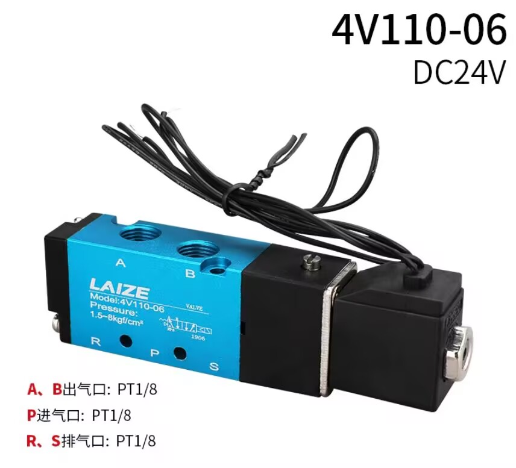

选取电磁阀一般要考量控制电压，根据大疆电池的供电，推荐选用DC24V。
电磁阀以4V110-06为例，购买时除了要买电磁阀本体，还需配上三个气嘴与两个消声器才能正常使用。气嘴与消声器的螺纹要配合电磁阀，气嘴根据气管的大小进行选择，可咨询客服后再购买。电磁阀气嘴大小最好跟气缸气嘴大小保持一致。为保证气路通畅，气管在接口处不能折或者大角度弯曲。

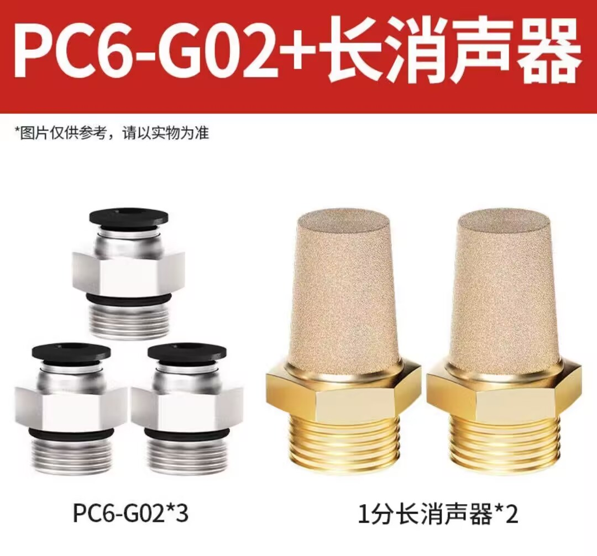

以PC6-G02气嘴与长消声器为例，长消声器分别拧到R、S口，PC6-G02气嘴分别拧到A、B、P口。AB口连接气缸的进气口与出气口，P口连接气瓶。谨记任何气动元件的旋合都要在螺纹处裹上一层防水胶。（如下图所示）

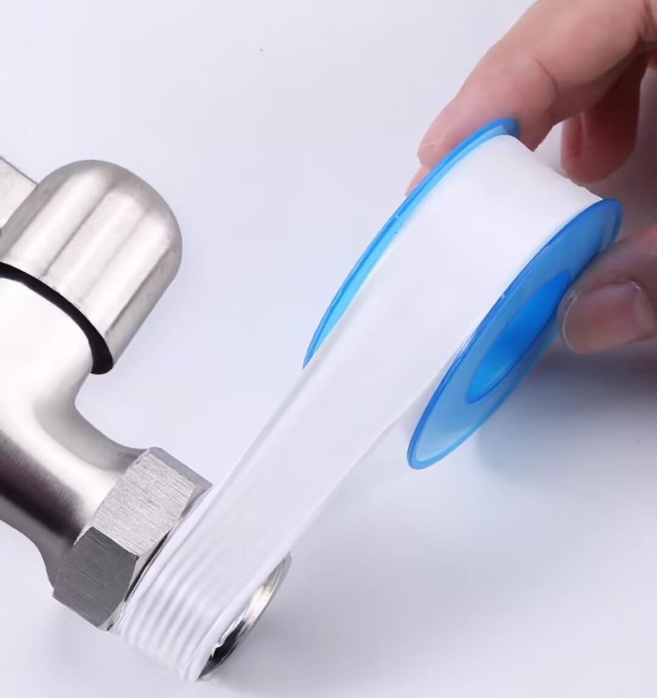

## 电磁锁

电磁锁由通电后可以产生磁力的衔铁和被吸引的锁舌组成，能够提供开断可控的大拉力，25年比赛的弹射方案使用了它来牵引弹簧。<!-- 弹簧容易疲劳，后续比赛若有弹射需求，可以尝试同步带/仿复合弓设计 -->

电磁锁需要使用继电器控制开断，通常不需要区分正负极。由于受力很大，设计时一定要考虑结构和材料能否承受。

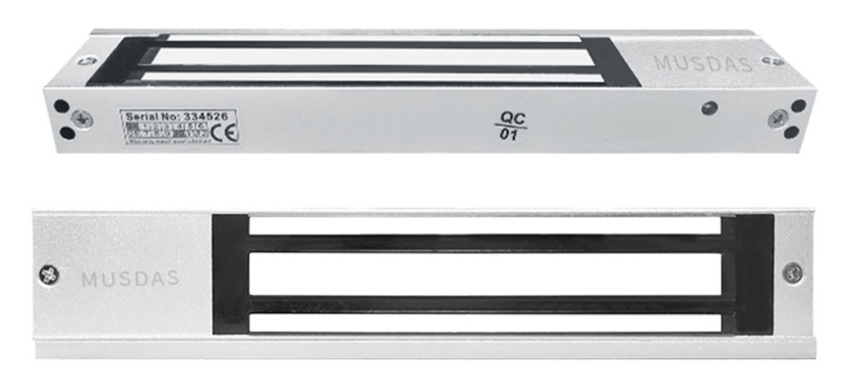

<div STYLE="page-break-after: always;"></div><!-- 分页 -->

# 软件层

电控应当掌握的基础知识，譬如引脚、中断、数模转化、通信和操作系统等是主力队员的基本要求，软件层这一部分的内容是帮助你在实现了机器人基本功能之后，再进行性能优化，提高上限。

这是老学长给的电控技能树\
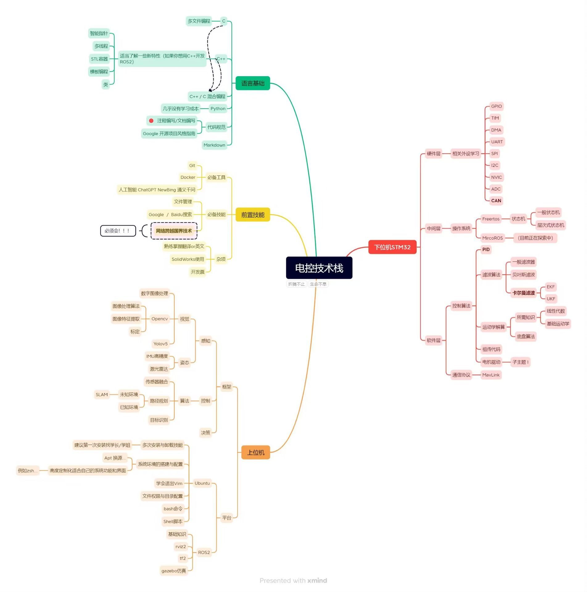

## 软件架构

尽管在现阶段我们不会要求所有人遵循统一的代码规范，但良好的软件架构能避免屎山代码的产生，帮助你后续更好的维护代码。

ssc学长在这方面专门写了一个文档。<!-- 让我们感谢舒晟超学长 -->

[工程框架](doc/工程框架.pdf)

### 代码分层

所谓代码分层，简而言之就是为你写的众多c文件h文件分个类。这一块每个人的理解都不完全相同，但总的来说，至少会分为三类：\
中间层代码。主要包括各种算法或控制函数。\
线程代码。rtos中开的各个线程都在这里，主要是机器人的控制逻辑。\
库代码。包含了官方提供或者学长传承的代码库，是如无必要绝不修改的部分。\
除此之外，还会有一些说明文档(README)，所用的软件库等。\
一个良好的代码分层可以大大提高代码的编写效率，可以参考学长们的代码分层。

### 状态机

一台机器人有很多结构，为了保证它们在运行时不会互相“打架”，就必须有一个专门的程序去协调控制，即状态机，通常起名为HSM。在状态机中，需要为每个机构定义所有可能的状态，编写状态转移函数。\
有了状态机，就可以很方便的判断机构执行动作的时机，进行良好的配合，同时也方便调试时查看各个机构的状态。

## 仿真调试

工欲善其事，必先利其器。电控在编写代码，尤其是纯算法的程序时，进行仿真模拟可以节约大量调试时间，同时能够避免错误算法造成硬件故障。至少要在仿真中跑通，才能烧录到单片机中进行实地调试。

### 仿真器

有一个好的烧写仿真器对电控的帮助很大。\
固然你可以直接在任意地方直接运行C代码，但这不能满足所有需求。\
STlink虽然也可以进行调试，但必须暂停运行，才能查看变量数值，也没有好用的可视化工具。\
根据经验，推荐使用Jlink + Ozone的组合，可以实时查看变量，能够可视化。

[Ozone调试教程](doc/Ozone调试教程.pdf)

### matlab仿真

校内课程会对matlab有些涉及，建议还是好好学，懂最基本的语法就可以，需要用到函数时上网查或者问AI就好。matlab有非常强大的函数库，且性能优秀，也有足够好的可视化。\
学了自控之后，还可以用matlab内含的simulink插件绘制系统框图，验证代码的控制算法效果。

下图是一个用matlab仿真滤波器的示例。\
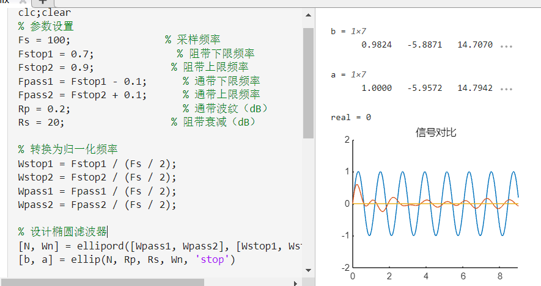

### gazebo仿真

更进一步，如果你想对实物进行3D模拟，那就可以用gazebo进行3D仿真。你可以导入3D模型，设置物理环境，然后在其中运行你的代码，这样的仿真更加贴近实际。网络上也有很多教程，学会了帮助还是很大的。

下图是一个用gazebo仿真SLAM建图的示例(素材来自网络)。\
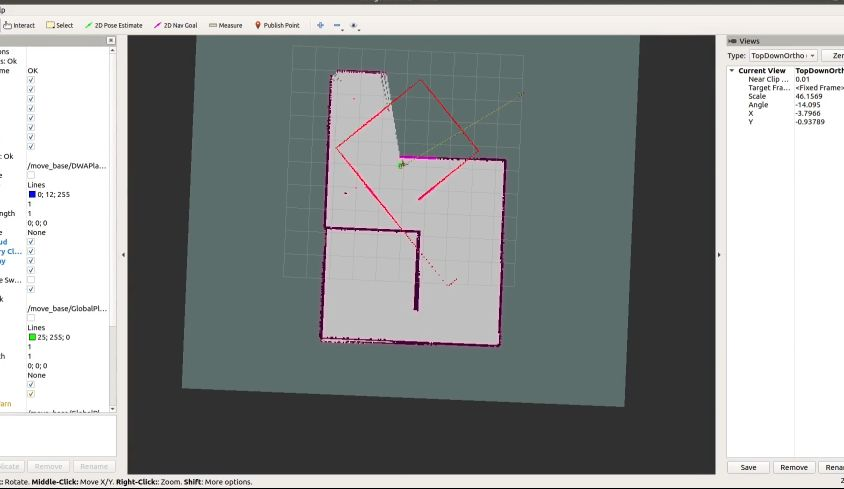

## 前馈算法

从这一部分开始，涉及很多自动控制原理的知识，学习系统框图和传递函数等相关概念后，能够更好的理解这些内容。

前馈 + PID能解决95%的控制问题，如果没能解决，就说明硬件选择不对。选择合适的前馈可以减小稳态误差，提高响应速度。

这里给出的前馈算法只是冰山一角，还有些涉及优化的算法在RC比赛中实用性不是很高，没必要大材小用。

### 阶跃输入平滑化

这其实不算是前馈，但还是放到了这里。一句话概括，就是把阶跃输入转化为斜坡输入。

例如你使用遥控器摇杆控制底盘运动，摇杆的模拟量越大速度越快，但实际使用往往是几乎瞬间将摇杆推到底，这时候就相当于一个阶跃输入。但是，哪怕参数调得再完美，底盘的各个电机响应速度也不可能完全相同，这时候就会产生差速，导致底盘漂移。

如果对输入进行限幅(例如连续的两次输入的差值不能超过预设值)，转化为斜坡输入，这时候就相当于对加速度进行了限制，较快响应的电机就会慢下来，与较慢响应的电机一致，从而减小差速。如果这个预设值取的合适，就可以在几乎不影响底盘整体响应速度的同时减少漂移。

### 开环模型逆前馈

这种算法的原理是根据开环时的输出预测前馈量。从代数角度看，假设开环输入为x(t)，实际输出为r(t)，期望输出为h(t)，当开环输入为y(t)时，有r(t) = h(t)，那么前馈值为y(t) - x(t)。用公式表示前馈函数为：
$$F(x,t) = r^{-1}_x[h(x,t)] - x(t)$$
在实际情况中，h(x)一般是已知的，且通常h(x) = x，例如对电机进行速度伺服，输入多少速度自然就是期望它输出多少速度。\
通常求解前馈函数的方法是，给定若干输入，测量合适的前馈值，记录为散点，使用建模软件(如matlab)拟合出前馈函数并写入程序。

有时候，如果只考虑稳态，前馈函数可以直接从物理模型中计算出来，这里举两种常见的情况。

对于控制直流电机，力矩与电流呈正比例关系，设系数为K。若力矩为T，外力只受动摩擦力为f，电流为I，角加速度为a，转动惯量为J，那么当电机以任意角速度匀速转动时，T - f = KI - f = Ja = 0。这说明I是一个只与摩擦力有关的固定值。因此无论输入是什么，前馈电流都是固定值，可以使电机刚好克服摩擦力。

对于控制机械臂的关节电机，外力只重力为G，竖直夹角为θ，那么当电机以任意角速度匀速转动时，T - Gsin(θ) = KI - Gsin(θ) = Ja = 0。这说明I是一个只与θ有关的函数。因此前馈电流就要根据电机的角度计算，使电机刚好克服重力矩。

如果还要考虑整个过程，比如加速阶段，就只好依靠建模计算了。

## 反馈算法

<!-- 有关各种反馈算法，可以上B站搜华南小虎队(知乎：龙胆也)，做的还是很好的 -->

### PID

最经典的反馈算法，不必多讲。PID是基于误差函数的算法，响应快，鲁棒性强，唯一的缺点可能是超调不好消除。\
对电机的控制基本上都是串级PID，外环的输出作为内环的输入。通常来说，外环的性能比内环要好。利用这一点，假如需要控制速度，对位置环进行微分输入的效果会比直接输入速度环要好一些。

PID的编写很简单，调参教程也很多，在往年比赛的代码中随处可见，不再单独附上。

### LQR

LQR(Linear Quadratic Regulator，线性二次型调节器)是一种最优控制算法，用于设计状态反馈控制器。它通过最小化一个包含状态偏差和控制输入的二次代价函数，来找到最优的控制策略。使用LQR的要求是系统必须是线性(即输出可以由输入线性表示)的或者近似线性的。

LQR的优势在于几乎无需调参，仅需要对系统参数有足够精确的了解，就可以计算出合适的增益系数。

LQR的推导与被控对象的物理模型有关(最经典的是平衡小车)，网上有许多教程，这里以直流电机角度伺服为例。LQR是基于整体状态误差的控制。

<font size = 2 face = "consolar" color = #ffffff>

```
float lqr_control(State x, State x_ref)//当前状态和目标状态
{
    // 计算状态误差
    float theta_error = x_ref.theta - x.theta;
    float omega_error = x_ref.omega - x.omega;

    // 这里直接赋值了，实际应用中应通过求解Riccati方程得到
    float k1 = 34.64;
    float k2 = 1.35;

    // 计算控制输入 (电流)
    float u = k1 * theta_error + k2 * omega_error;

    return u;
}
```
</font>

使用matlab计算增益系数：
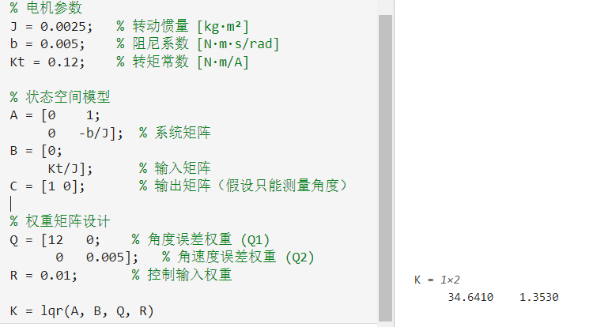

仅从示例代码来看，无非就是通过系统参数计算出增益系数(由于系统参数通常固定，往往可以提前计算写入程序)，利用位置误差和速度误差做反馈，由于速度误差就是位置误差的微分，所以这本质上相当于一个PD控制器。区别在于你不是根据经验和现象手动调参，而是根据需求计算参数。

因此，类似PID，如果发现LQR输出存在稳差，可以引入积分项。

### MPC

在每个控制周期，MPC通过预测模型计算未来N步的系统输出，通过优化目标函数（如跟踪误差+控制量约束）得到最优控制序列，仅执行第一步控制量。

<!-- 这算是相对先进的算法，到目前为止可能还没有学长用过，RC比赛也不是很用得上，了解即可。如果未来有应用的实例可以补充在这里^_^ -->

### SMC

即滑模控制。这是一种非线性控制策略，其核心思想是通过设计一个特定的“滑模面”，将系统状态强制驱动到该滑模面上，并在滑模面上保持运动。滑模控制以强鲁棒性和快速响应著称，唯一缺点是控制时容易产生抖震(可以引入饱和函数解决)。

<!-- 设计时需要用到李雅普诺夫稳定条件，有些超纲，同样是了解即可。 -->

## 滤波算法

滤波的本质是对输入进行预处理，消除噪声，平滑数据，进而改善前馈或者反馈的性能。

### 滑动窗口滤波

一般就是指均值滤波，这是最简单的滤波算法。本质上是引入一个固定长度队列(这个队列就是观测窗口)，每次得到新的数据都加入队尾(故称滑动)并删掉队首数据，然后取整个队列的平均值作为滤波结果。

这个滤波器比较简单，因此不单独附上代码。

滑动窗口滤波的优点是简单有效，面对高频噪声可以很好的去除。缺点是滤波数据存在延迟，对采样频率要求高，不适合处理实时性较强的数据。

### 卡尔曼滤波(贝叶斯滤波)

贝叶斯滤波是一种基于贝叶斯定理的递归概率估计方法，通过融合先验知识和观测数据，动态更新系统状态的后验概率分布。卡尔曼滤波是贝叶斯滤波在线性高斯系统下的最优解析解。假设系统动态和观测均为线性，且噪声服从高斯分布。卡尔曼滤波能够最小化均方误差。

卡尔曼滤波的优点是输出预测数据，因此无延迟。缺点是低阶卡尔曼滤波器不能处理非线性数据，高阶卡尔曼滤波器参数众多，不方便调参。

卡尔曼滤波器的调参推荐先仿真调出一个差不多的，再实装细调。

这里附上两个版本的卡尔曼滤波代码。一个是22年的老学长写的(非常详细且全面，可以仔细学习)。另一个是我自己写的(包括一维和二维，相对轻量化)。

[卡尔曼滤波代码(详细版)](code/算法/kfA/kalman_filter.c)

[卡尔曼滤波代码(轻量版)](code/算法/kfB/kalman_filter.c)

### 傅里叶滤波

傅里叶滤波器泛指各种基于频带滤波的滤波器。上了信号这门课后，会教如何设计数字滤波器。

还是这张图。\
图中前面都是对滤波器的参数设置，ellip函数是用于设计椭圆滤波器的，还有其他滤波器设计函数。返回的b和a是离散传递函数的分母和分子，做Z逆变换后即可得到时域上的函数，用C语言表达即可。


某个六阶滤波器的代码示例：

<font size = 2 face = "consolar" color = #ffffff>

```
double IIRFilter(IIRFilter* filter, double input){
    // 计算输出: y[n] = sum(b_k * x[n-k]) - sum(a_k * y[n-k-1])
    double output = filter->b[0] * input;
    // 前6个输入延迟项 (x[n-1]到x[n-6])
    for (int i = 0; i < filter->order; i++) {
        output += filter->b[i + 1] * filter->x_buf[i];
    }
    // 前6个输出延迟项 (y[n-1]到y[n-6])
    for (int i = 0; i < filter->order; i++) {
        output -= filter->a[i + 1] * filter->y_buf[i];
    }
    // 除以a0 (通常a0=1)
    output /= filter->a[0];
    // 移动x_buf
    for (int i = filter->order - 1; i > 0; i--) {
        filter->x_buf[i] = filter->x_buf[i - 1];
    }
    filter->x_buf[0] = input;
    // 移动y_buf
    for (int i = filter->order - 1; i > 0; i--) {
        filter->y_buf[i] = filter->y_buf[i - 1];
    }
    filter->y_buf[0] = output;
    return output;
}
```

</font>

傅里叶滤波器的优点是便于设计，针对性强。缺点是要求知道噪声的频带(需要记录数据，然后用matlab做频谱分析)，且容易失真。

## 定位

参考的是深圳北理莫斯科大学北极熊战队的方案，可以直接上网搜。

<!-- 以下是负责同学给的很详细的使用说明，由音频转译 -->

基本依赖：\
Ubuntu22.04\
ROS2 humble

1. 首先安装ubuntu22.04系统

快捷键：\
ctrl+shift+c	复制\
ctrl+shift+v	粘贴\
ctrl+alt+t		打开独立页面终端\
ctrl+shift+t	在已经打开的终端前提下额外开一个共用同一页面终端\
ctrl+d		关闭终端\
ctrl+c 		退出程序

a. 双系统\
(内存给大点，而且建议用双系统，能少一些不必要的麻烦，但是用虚拟机也行)

b. 虚拟机\
vmwareworkstation和vmplayer(相当于station的简化版，界面更简洁，功能也更少)都可以，网上都很容易找，还是上CSDN找教程网盘容易些。[官网](https://support.broadcom.com)(安装其中之一)\
<提供一下ubuntu22.04iso>

安装vscode<font size = 3 face = "Cconsolas">
```
1.去官网下在下载目录下打开终端运行sudo dpkg -i ./<package name>
2.software下载
以后就可以code 路径打开对应文件夹了比如code .
安装一下clash for verge<好像登不上GitHub,提供一下包>sudo dpkg -i ./<pakcage name>
但是有可能出现下载下来但是打不开现象，原因是某些依赖没下载下来，此时换一种安装指令:sudo apt install ./<package name>它会自己处理依赖，然后让你运行apt --fix-broken install,然后再运行sudo apt install ./<package name>就安装成功了，可以打开了
安装一下vim(文本编辑器):sudo apt update;sudo apt upgrade;sudo apt install vim
```
</font>

2. 在ubuntu里面安装ROS2humble环境

参考网址小鱼论坛：fishros.org.cn
安装ros版本，[参考网址](https://fishros.org.cn/forum/topic/3923/ros%E4%B8%80%E9%94%AE%E5%AE%89%E8%A3%85/2)

虽然说网站是说装ros1，但是显然wget http://fishros.com/install -O fishros && bash fishros这条指令可以装ros2humble而且很快

安装ros2版本，[参考网址](https://fishros.org.cn/forum/topic/3050/ros2%E5%AE%89%E8%A3%85/2)

sudo apt update\
sudo apt upgrade\
wget http://fishros.com/install -O fishros && bash fishros

这条指令也可以装QQ微信，但不知道是不是最新版本的，当然也可以去官网下。(看来不是最新)\
然后验证是否安装成功\
先在~/.bashrc中source 一下ros2环境,他会自动执行一边bash里面的脚本文件(修改环境变量)\
记得先新开一个终端，原来的终端没有运行主目录下的脚本文件	\
随便运行一条ros2的指令\
ros2 run turtlesim turtlesim_node (可以按table键补全哦)可以看见小海龟了\
再运行 ctrl+shift+t\
ros2 run teleop_twist_keyboard teleop_twist_keyboard\
如果不能控制小海龟走，说明可能是话题没对应，直接ros2 topic pub /turtle1/cmd_vel geometry_msgs/Twist "{linear: {x: 1.0, y: 0.0, z: 0.0},angular: {x: 0.0, y: 0.0, z: 1.0}}"\
可以看见小海龟画圈圈\
如果要用遥控器那得去humble里面改一下它的包了，不知道为啥，遥控器怎么不和小海龟适配了，要改的话就要去包里面改一下话题名

3.为包安装相应依赖

[CSDN小鱼文档](https://blog.csdn.net/qq_27865227/article/details/125069160)\
用小鱼的指令一键装环境:\
wget http://fishros.com/install -O fishros && bash fishros

CSDN上面有指引

a. 2d雷达<font size = "3" face = "Consolas">
```
absl库(c++基础库，用于补充c++标准库)：
	sudo apt install libabsl-dev(用这个)

	git clone https://github.com/abseil/abseil-cpp.git
	cd abseil-cpp
	mkdir build && cd build
	cmake -DCMAKE_INSTALL_PREFIX=/usr/local ..  # 默认安装到系统目录
	make -j4
	sudo make install
Ceres库(一个c++数学库):
	sudo apt-get install libceres-dev
Lua包(lua文件)：
	sudo apt-get install liblua5.4-dev
protocol buf包：
	sudo apt-get install libprotobuf-dev protobuf-compiler
cairo包：
	sudo apt-get install libcairo2-dev
3d雷达的驱动包livoxSDK2:
	git clone https://github.com/Livox-SDK/Livox-SDK2.git
	cd Livox-SDK2
	mkdir build && cd build
	cmake ..
	make
	sudo make install
serial包(ros2)：
	colcon build
	source ~/serial/install/setup.bash
pcl_ros:sudo apt-get install libpcl-dev
eigen:sudo apt-get install libeigen3-dev
(sudo apt-get install ros-${ROS_DISTRO}-pcl-conversions ros-${ROS_DISTRO}-perception-pcl)
octomap:sudo apt-get install liboctomap-dev octomap-tools
diagnostic_updater:	sudo apt-get install ros-$ROS_DISTRO-diagnostic-updater
pcap: sudo apt-get install libpcap-dev
tf2_ros:sudo apt install ros-humble-tf2-ros


joint-state-publisher:sudo apt install ros-humble-joint-state-publisher
xacro: sudo apt install ros-humble-xacro
gazebo_ros: sudo apt install ros-humble-gazebo-ros-pkgs
pointcloud-to-laserscan: sudo apt install ros-humble-pointcloud-to-laserscan

cartographer:出现代码报错，absl建议用sudo 安装，不要sudo装一遍，然后git源代码装一遍，这样可能冲突，导致cartographer代码编译报错

cartographer这个包编译了快30min，快吐了
dll这个给包也要很久
```
</font>
b. 3d雷达(mid360和L2)</br>

4. 运行

修改环境变量： sudo gedit ~/.bashrc\
在工作空间的终端下\
colcon build\
source install/setup.bash

雷达使用一般思路：\
2d雷达\
开启驱动包lslidar_driver\
开启点云转化包cptocloud\
开启建图包\
cartographer\
开启定位包\
3d雷达\
开启驱动包\
开启建图包fastlio mapping(记得修改一下话题使之对应)\
开启定位包relocation(里面好像没有)

功能包干嘛的看好一下源文件或者丢给AI问一下就行了\
sensor_driver下面除了2d_lidar_driver外其他都是给3d用的\
sensor_bridge下面除了sensordriver其他都是实现同一个功能的上下位机通信包，只是有细微差别，运行时只运行一个就行

运行包时不要重复运行同时运行同一个包，会串话题
<font size = 3 face = "Consolas">
```
ros2软件源：http://packages.ros.org/ros2/ubuntu/
下载完后安装：sudo dpkg -i <包名> //仅安装
sudo apt install <deb文件名.deb> //会处理依赖
```
</font>

[25年雷达代码](code/往年代码/25/WTR_2025/README.md)

## 视觉


<div STYLE="page-break-after: always;"></div><!-- 分页 -->

# 往年代码

每年都有两台车，一台车可能不止一个主控板，上位机有代码，遥控器也有代码，一台车有不同的方案，同个方案可能还有不同版本的代码。因此代码很多，这里尽可能收集全。一部分学长会上传到自己的github上，也可以尝试搜索。

**从25届开始，所有上传的工程代码应该在下文进行备注，注明工程的用途。**

路径：code/往年代码

## 25

r2v1pop: R2V1弹射方案代码\
WTR_2025: R2雷达代码\
wtr25_r2_v2_chassis: R2V2全向轮、V3舵轮底盘代码

</font>